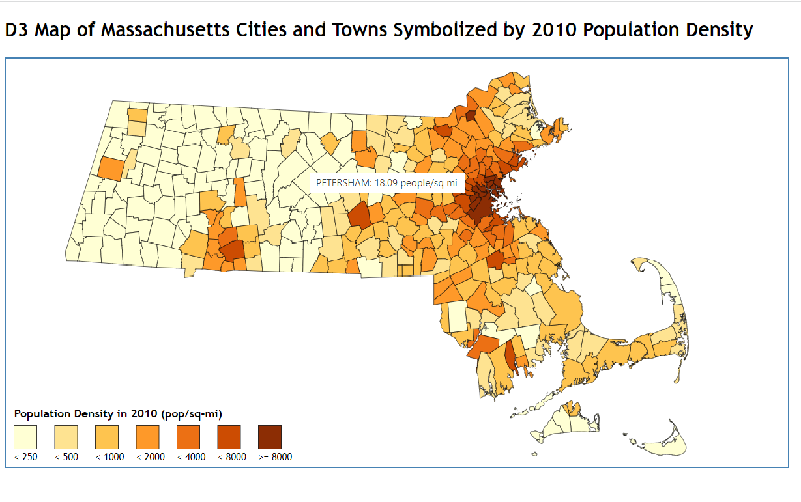

# d3-choropleth-demo
Demo illustrating how to generate a choropleth map with d3.js

This demo relies upon:
* the d3.js library, loaded from a CDN
* the colorbrewer2.js library loaded from [colorbrewer2.org](https://colorbrewer2.org)

The original version of this demo was presented at April 3, 2015 CommGIS meeting and at MassIT on April 24, 2015.
The original version used version 3 of the d3.js library; it was migrated to version d3.js version 6 on January 6, 2021.



## Internals
### Loading of the Data
Execution begins with the statement
```
d3.json("json/TOWNS_POLYM.geo.json").then((data) => { generateMap(data); });
```
which loads the GeoJSON for the MassGIS TOWNS_POLYM layer asynchronously using d3's __d3.json__ method.
When loading of the data is complete, the function __generateMap__ is called to create the map visualization.

### Creating the Visualization
Creation of the visualization is broken down into the following steps,
which are indicated by comments in the JavaScript source file:
1. Define dimensions of SVG drawing space
2. Create SVG drawing space and append it to the HTML DOM
3. Define the native projection of the data (Mass State Plane, NAD 83, meters)
4. Create a 'geographic path generator' function to create SVG \<path\> elements from the raw geographic data;
   one SVG \<path\> element is created for each geographic feature, i.e., for each town.
5. Define a color palette to symbolize the map; we use a 7-step Yellow-Orange-Brown (__YLOrBr__) color palette
from the __colorbrewer__ library
6. Create the SVG \<path\> for each town
7. Create a data structure to hold the information to render in the map legend
8. Create the SVG \<rect\> elements for the color swaths in the legend
9. Create the SVG \<text\> elements for the legend's caption
10. Create the SVG \<text\> elements for the second line of text in the legend

See [this repository](https://github.com/bkrepp-ctps/d3-thematic-map-demo) for information on steps \(3\) and \(4\).
